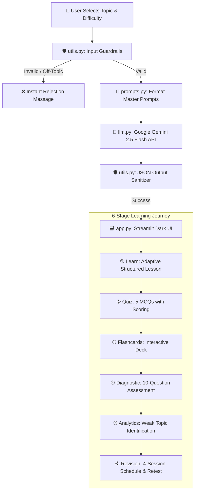

# 🐍 PYTHON PULSE — Python Course Study Assistant

[](https://python-course-study-assistant-atguuqjkevipwsewkgywwj.streamlit.app/)
[](https://python.org)
[](https://ai.google.dev/)
[](LICENSE)

> **Live Application URL:** [https://python-course-study-assistant-atguuqjkevipwsewkgywwj.streamlit.app/](https://python-course-study-assistant-atguuqjkevipwsewkgywwj.streamlit.app/)  
> **Target:** AI-Powered Python Learning Assistant with Rigorous Prompt Engineering, Guardrails, Knowledge Diagnostics, and Measurable Evaluation.

---

## 📌 Problem Statement

Learning Python independently often suffers from four key challenges:
1. **Generic Explanations:** Static chatbots provide generic answers without tailoring depth to student proficiency levels (Beginner, Intermediate, Advanced).
2. **Unpredictable Output Formats:** Unconstrained LLMs produce inconsistent text formatting that breaks frontend study tools.
3. **No Continuous Diagnostic Loop:** Lack of automated assessment to detect weak conceptual areas and prescribe targeted revision.
4. **Vulnerability to Hallucinations & Injections:** Non-Python queries or invalid requests cause standard models to drift off-topic.

**PYTHON PULSE** solves these issues through a multi-stage prompt engineering architecture, dual-layer guardrails, diagnostic assessment loops, and structured JSON generation.

---

## 🚀 Key Features

* **📚 Adaptive Structured Learning:** Generates depth-calibrated explanations with syntax, runnable examples, pitfalls, and key takeaways for Beginner, Intermediate, and Advanced coders.
* **❓ 5-Question MCQ Engine:** Real-time generation of 5 multiple-choice questions with answer keys and instant feedback.
* **🎴 Interactive Flashcards:** 5 flip cards tailored to the selected topic for rapid memorization and syntax recall.
* **🩺 10-Question Diagnostic Assessment:** Evaluates cross-topic competency across Core Fundamentals, Control Flow, Functions, and OOP.
* **📊 Knowledge Gap Identification:** Automatically categorizes performance into:
  - 🟢 **Strong** ($\ge 80\%$)
  - 🟡 **Developing** ($60\% - 79\%$)
  - 🔴 **Weak** ($< 60\%$)
* **🔄 Personalized 4-Session Revision Path:** Generates a structured study schedule and adaptive retest for identified weak topics.
* **🛡️ Dual-Layer Guardrails:**
  - *Input Layer:* Filters empty strings, length overruns (>300 chars), and off-topic queries.
  - *Output Layer:* Enforces deterministic JSON schema validation and auto-recovery.
* **🧪 Benchmark Evaluation Suite:** Evaluates baseline vs. final prompts against 12 labelled test cases.

---

## 🔄 System Architecture & Workflow



---

## 📊 Evaluation & Measured Results

We evaluated the initial naive prompt ($V_1$) against our final multi-stage prompt architecture ($V_{\text{FINAL}}$) across **12 labelled test cases**:

$$\text{Format Validity Rate} = \left( \frac{\text{Number of Valid and Compliant Outputs}}{\text{Total Labelled Test Cases}} \right) \times 100$$

### Benchmark Comparison

| Version | Description | Passed / Total | Format Validity Rate |
| :--- | :--- | :---: | :---: |
| **Version 1 (Initial $V_1$)** | Single-turn unconstrained prompt without schemas or guardrails | 8 / 12 | **66.7%** |
| **Version Final ($V_{\text{FINAL}}$)** | Role prompting + few-shot exemplars + dual guardrails + self-validation | 12 / 12 | **100.0%** |

$$\Delta \text{ Improvement} = \mathbf{+33.3\%}\ \text{Increase in Reliability \& Schema Compliance}$$

---

## 👥 Team Roles & Responsibilities

| Team Member | Project Role | Primary Files & Deliverables |
| :--- | :--- | :--- |
| **Nikhil (Team Lead)** | Architecture & Deployment Lead | • Frontend design & Streamlit app controller (`app.py`)<br>• Google GenAI SDK client integration (`llm.py`)<br>• Streamlit Cloud deployment |
| **Devendrasinh** | System & Personalization Engineer | • Master system prompts & difficulty adaptation (`prompts.py`)<br>• Quiz, Flashcard & 4-session revision templates<br>• Prompt schemas (`memberwise_promnt.md`) |
| **Phani** | Guardrails & Analytics Engineer | • Input domain validation & off-topic filtering (`utils.py`)<br>• Output JSON sanitization & error recovery<br>• Mastery threshold scoring (Strong/Developing/Weak) |
| **Niki** | Evaluation & Prompt Design Lead | • Prompt evolution ($V_1 \rightarrow V_{12}$) strategy (`prompt.md`)<br>• Benchmark suite & 12 test cases (`evaluator.py`, `test_cases.csv`)<br>• Prompt history logging (`prompt_history.csv`) |

---

## 📂 Project Structure

```text
Python-Course-Study-Assistant/
│
├── app.py                  # Streamlit frontend UI & stage controllers
├── llm.py                  # Google GenAI SDK (Gemini 2.5 Flash) integration
├── prompts.py              # Prompt engineering templates (V1 -> V12)
├── utils.py                # Input/output guardrails & scoring logic
├── evaluator.py            # Automated benchmark evaluation suite
├── test_cases.csv          # 12 labelled test cases for evaluation
├── prompt_history.csv      # Audit trail of prompt iterations
│
├── prompt.md               # Complete Prompt Engineering documentation & metrics
├── workkflow.md            # Detailed workflow and file-by-file matrix
├── memberwise_promnt.md    # Member-grouped prompt schemas and templates
├── README.md               # Project overview and setup instructions
│
├── requirements.txt        # Python package dependencies
├── .env.example            # Environment variable template
└── .gitignore              # Git ignore rules
```

---

## 🛠️ Quick Start & Local Setup

### 1. Clone the Repository
```bash
git clone https://github.com/Nikhilbhanderi91/Python-Course-Study-Assistant.git
cd Python-Course-Study-Assistant
```

### 2. Create and Activate a Virtual Environment
```bash
# macOS/Linux:
python3 -m venv .venv
source .venv/bin/activate

# Windows:
python -m venv .venv
.venv\Scripts\activate
```

### 3. Install Dependencies
```bash
pip install -r requirements.txt
```

### 4. Configure Environment Variables
Create a `.env` file from `.env.example`:
```bash
cp .env.example .env
```
Add your Gemini API Key in `.env`:
```env
GEMINI_API_KEY=your_gemini_api_key_here
```
*(Note: If no API key is provided, the application runs in deterministic **Demo Mode**).*

### 5. Launch the Application
```bash
streamlit run app.py
```
Open your browser at `http://localhost:8501`.

---

## 🔬 Running Evaluation Benchmark
To run the 12-case evaluation suite via CLI:
```bash
python evaluator.py
```

---

## 🌐 Live Cloud Deployment
Experience the live application hosted on Streamlit Cloud:  
👉 **[https://python-course-study-assistant-atguuqjkevipwsewkgywwj.streamlit.app/](https://python-course-study-assistant-atguuqjkevipwsewkgywwj.streamlit.app/)**
