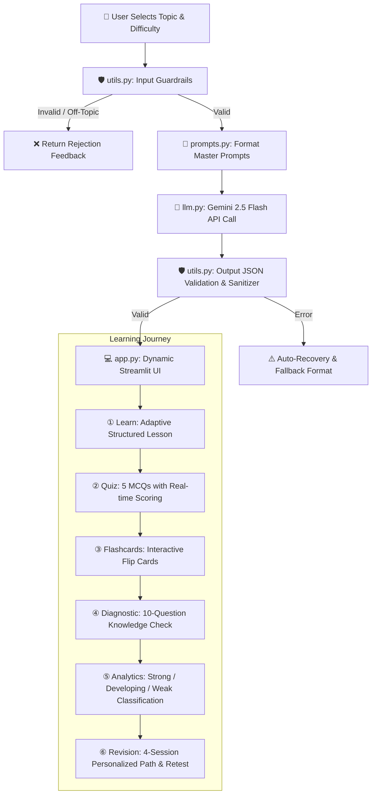

# 🐍 Python Course Study Assistant — System Workflow & Architecture

**Project:** Python Course Study Assistant (`PYTHON PULSE`)  
**Deployed URL:** [https://python-course-study-assistant-atguuqjkevipwsewkgywwj.streamlit.app/](https://python-course-study-assistant-atguuqjkevipwsewkgywwj.streamlit.app/)  
**LLM Engine:** Google Gemini 2.5 Flash via official `google-genai` SDK  

---

## 🏗️ 1. High-Level Architecture Workflow

The system connects user interaction, prompt chains, validation layers, LLM generation, and personalized diagnostics in a seamless 6-step loop:



---

## 📂 2. File-by-File Responsibility Matrix

| File Name | Primary Role | Key Responsibilities & Functions |
| :--- | :--- | :--- |
| **`app.py`** | **Frontend & UI Controller** | • Manages Streamlit state across 6 learning stages.<br>• Custom CSS dark theme (`#0B0F14`, `#1F1F1F`, `#CE422B`).<br>• Interactive widgets: topic selector, MCQ runner, flashcards, diagnostic tracker, and 4-session revision viewer. |
| **`llm.py`** | **LLM Gateway & Client** | • Initializes official Google GenAI Client (`genai.Client`).<br>• Manages `gemini-2.5-flash` model configuration.<br>• Handles API latency, JSON mode responses, and graceful error handling. |
| **`prompts.py`** | **Prompt Engineering Core** | • Stores all structured prompt templates ($V_1 \rightarrow V_{12}$).<br>• Tiered difficulty adaptation (Beginner, Intermediate, Advanced).<br>• Functions: `get_learn_prompt()`, `get_quiz_prompt()`, `get_flashcard_prompt()`, `get_diagnostic_prompt()`, `get_revision_prompt()`. |
| **`utils.py`** | **Guardrails, Safety & Scoring** | • **Input Guardrails:** Filters empty strings, character length limits, and off-topic domain validation.<br>• **Output Guardrails:** Strips markdown backticks and validates JSON structure.<br>• **Performance Scoring:** Classifies topics into Strong ($\ge 80\%$), Developing ($60-79\%$), and Weak ($<60\%$). |
| **`evaluator.py`** | **Automated Benchmark Runner** | • Evaluates prompts against labelled test sets.<br>• Tests positive cases, boundary conditions, edge cases, and adversarial prompt injections.<br>• Calculates **Format Validity Rate** and exports benchmark metrics. |
| **`test_cases.csv`** | **Labelled Benchmark Dataset** | • Contains 12 labelled test cases (E01 to E12) with category, difficulty, input text, and expected status (`success` or `rejected`). |
| **`prompt.md`** | **Prompt Evolution & Metric Docs** | • Full documentation of prompt iterations $V_1 \rightarrow V_{12}$.<br>• Documents limitations, improvements, and metric results ($V_1: 66.7\% \rightarrow V_{\text{FINAL}}: 100\%$).<br>• Hackathon problem statement and presentation guide. |
| **`memberwise_promnt.md`** | **Team Prompt Schemas** | • Exact prompt templates, JSON schemas, and few-shot examples mapped by team member ownership. |
| **`prompt_history.csv`** | **Version History Log** | • Chronological audit trail of prompt versions with timestamps, changes, and observed outputs. |
| **`requirements.txt`** | **Dependencies** | • `streamlit`, `google-genai`, `python-dotenv`, `pandas`. |
| **`demo.py` & `test.py`** | **CLI Verification Scripts** | • Standalone CLI testing scripts for testing API connectivity and prompt validation outside the browser. |

---

## 🔄 3. Step-by-Step Execution Lifecycle

### Step 1: Input & Guardrail Verification
1. User chooses a topic (e.g. `Lists & Tuples`) or inputs a custom topic and sets difficulty (`Beginner`, `Intermediate`, `Advanced`).
2. `utils.validate_input(topic)` verifies:
   - Topic length $\le 300$ characters.
   - Non-empty input.
   - Rejects non-programming or off-topic prompts.

### Step 2: Prompt Generation & LLM Calling
1. `prompts.py` constructs a system and user prompt with:
   - Strict persona and role instructions.
   - Few-shot structure exemplars.
   - Strict JSON output schema constraints.
2. `llm.generate_response(prompt)` invokes Google Gemini 2.5 Flash (`google-genai` SDK).

### Step 3: Output Sanitization & Parsing
1. `utils.clean_json_response(raw_text)` removes markdown markdown fences (` ```json `).
2. Parses into Python dictionary; if malformed, triggers fallback recovery logic.

### Step 4: Interactive Frontend Rendering
1. **Learn Mode:** Renders concept, explanation, syntax, runnable examples, common pitfalls, and key takeaways.
2. **Quiz Mode:** Displays 5 interactive MCQs with instant feedback and explanations.
3. **Flashcard Mode:** Interactive flip cards for rapid memorization.
4. **Diagnostic Mode:** Runs a 10-question assessment across all Python competencies.
5. **Analytics & Revision Mode:** Identifies knowledge gaps and constructs a tailored 4-session revision plan with targeted retesting.

---

## 👥 4. Team Ownership & Task Allocation

```text
┌────────────────────────────────────────────────────────────────────────┐
│                        PYTHON PULSE TEAM ROLES                         │
├───────────────────┬────────────────────────────────────────────────────┤
│ Nikhil (Lead)     │ • Architecture, Streamlit Frontend & UI (app.py)   │
│                   │ • LLM Integration & Gemini API SDK (llm.py)        │
│                   │ • Live Streamlit Cloud Deployment                  │
├───────────────────┼────────────────────────────────────────────────────┤
│ Devendrasinh      │ • Master System Prompts & Learning Templates       │
│                   │ • Difficulty Adaptation & Quiz/Diagnostic Prompts  │
│                   │ • Revision & Personalization Engine (prompts.py)   │
├───────────────────┼────────────────────────────────────────────────────┤
│ Phani             │ • Input Guardrails & Off-Topic Filtering           │
│                   │ • Output JSON Validation & Sanitizer               │
│                   │ • Mastery Analytics & Scoring Algorithms (utils.py)│
├───────────────────┼────────────────────────────────────────────────────┤
│ Niki              │ • Prompt Strategy & Iterations (V1 -> V12)         │
│                   │ • Benchmark Evaluation & Test Set (evaluator.py)   │
│                   │ • Metric Reporting & Documentation (prompt.md)     │
└───────────────────┴────────────────────────────────────────────────────┘
```
